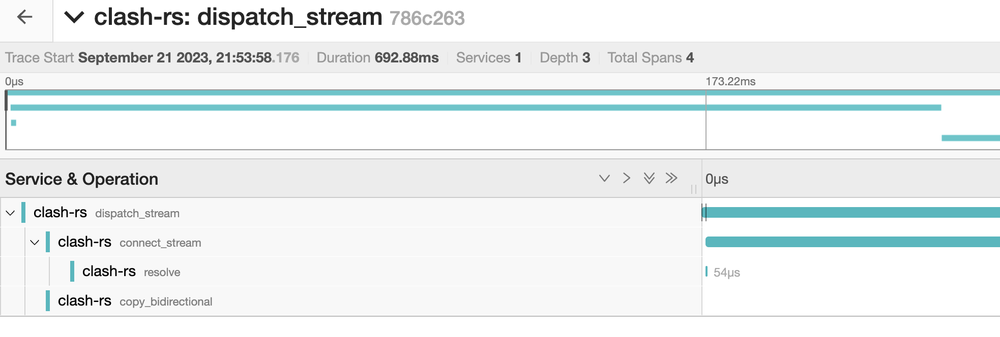

# 🔀 Tracing with Jaeger

ClashRS supports OpenTelemetry-based tracing. To enable it, build with the `telemetry` feature flag (renamed from `tracing` in v0.10.0):

```shell
cargo build --features telemetry
```

Then set the Jaeger endpoint via environment variable before running:

```
JAEGER_ENDPOINT=http://your-jaeger:14268/api/traces
```

<figure><figcaption></figcaption></figure>
